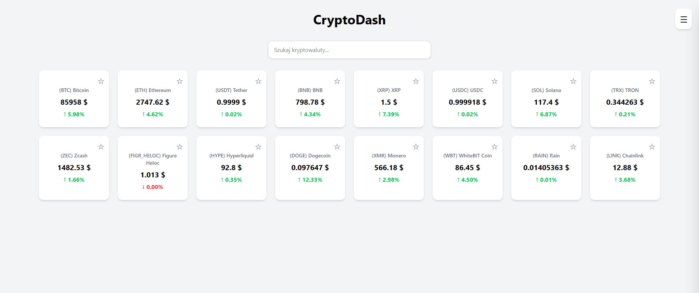
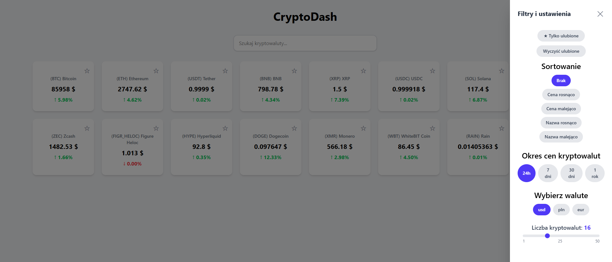
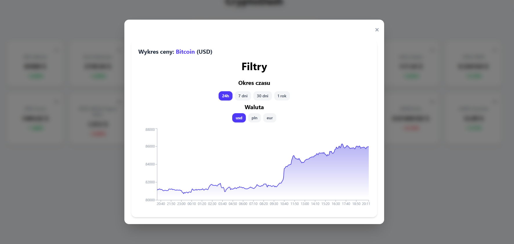

# CryptoDash

Educational cryptocurrency tracking dashboard created to practice React state management, external API integration, and interactive data visualization.

## Look of application

Application preview:

## Main functionalities
* **Real-time market tracking**: Automatic data polling every 10 seconds for the top 50 cryptocurrencies via CoinGecko API.
* **Interactive price charts**: Historical price trends visualized with `Recharts` (`AreaChart`) across multiple timeframes (24h, 7 days, 30 days, 1 year).
* **Multi-currency support**: Instant price recalculation for USD ($), EUR (€), and PLN (zł).
* **Search and filtering**: Fast client-side search by name or symbol, along with a custom item limit slider (1–50).
* **Sorting**: Sorting assets by price or name (ascending and descending).
* **Favorites system**: Persistent bookmarking of selected coins using `localStorage`.

## Technologies Used
* **Frontend**: React, JavaScript, Tailwind CSS.
* **Data Visualization**: Recharts.
* **Build Tool**: Vite.
* **External API**: CoinGecko API (REST).
* **State & Persistence**: React Hooks (`useState`, `useEffect`), Web Storage API (`localStorage`).

## Technical challenges
When I made this project, I focused on:
* Handling periodic data polling with `setInterval` and preventing memory leaks through proper cleanup in `useEffect`
* Safe communication with `localStorage` wrapped in `try-catch` blocks to support restricted/incognito browser modes
* Dynamically mapping user UI filters (timeframes, currencies) to CoinGecko API parameters
* Maintaining a clean UI layout with modal popups and responsive slide-out drawer navigation

## How to run
1. **Clone the repository**: `git clone [link]`
2. **Environment configuration**: Create `.env` file and set `VITE_COINGECKO_API_KEY=your_api_key`
3. **Install dependencies**: `npm install`
4. **Run development server**: `npm run dev`

---
*Created by Wiktor Mazur*